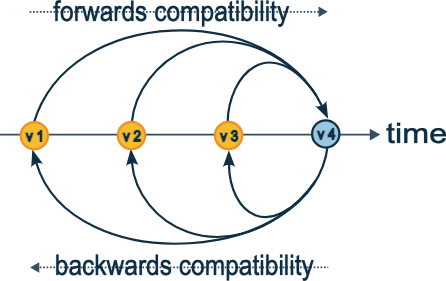

# Getting Started

> [Reference Documentation](https://ddia.vonng.com/tw/ch5/#sec_encoding_avro)

# 學習資源

- [Apache Avro 官方文件](https://avro.apache.org/docs/current/)
- [gradle-avro-plugin 產出物件套件](ttps://github.com/davidmc24/gradle-avro-plugin)

## 學習步驟

### 學習如何定義 Avro Schema

1. 創建 .avsc 在 `/ch1-avro/src/main/avro/userJson.avsc`
2. 安裝 plugin: Avro Schema Support 這樣閱讀 [userJson.avsc](src/main/avro/userJson.avsc) 才可以看得懂
3. build.gradle.kts 裡面加入 avro 的 plugin
    ```kotlin
    plugins {
        id("com.github.davidmc24.gradle.plugin.avro") version "1.7.1"
    }
 
    dependencies {
        implementation("org.apache.avro:avro:1.11.1")
    }
    ```
4. 執行 ./gradlew build 會自動產生 avro 的 class
    ```bash
    cd ch1-avro 
    ./gradlew generateAvroJava
    # BUILD SUCCESSFUL in 558ms
    # 檔案會在 [UserAvro.java](build/generated-main-avro-java/userJson/avro/UserAvro.java)
    ``` 
5. 產生的 class 可以直接使用
    ```java
    UserAvro userAvro = new UserAvro(name, favoriteNumber, favoriteColor);
    ```

### 使用 Avro 序列化/反序列化

1. 用 DatumWriter 把 User 物件寫成 Avro 二進位檔案, 用 DatumReader 讀回 User 物件。
    - [UserAvroMapper.java](src/main/java/com/example/ch1avro/mapper/UserAvroMapper.java)
2. 用 Jackson
    1. 引用套件
    ```kotlin
    // 由於已經引用 spring boot starter web 會帶入 jackson core，所以只要引入 avro 就好
    implementation("com.fasterxml.jackson.dataformat:jackson-dataformat-avro:2.17.2")
    ```
3. 比較 JSON vs Avro
   的大小與效能差異。[CompareUtils.java](src/main/java/com/example/ch1avro/utils/CompareUtils.java)
    1. 序列化後的 byte array 長度 → 看空間大小差異
       ```text
       avroBytes.length: 16, jsonBytes.length: 63
       ```
    2. 序列化 + 反序列化的耗時 → 看效能差異(
       參考下方QA [為什麼 JSON serialize 比較快](#為什麼-json-serialize-比較快))
       ```text
       --- serialize time compare ---
       Avro Origin serialize time: 551 ms
       Avro Jackson serialize time: 683 ms
       Json serialize time: 360 ms

       --- deserialize time compare ---
       Avro Origin deserialize time: 571 ms
       Avro Jackson deserialize time: 622 ms
       Json deserialize time: 601 ms
       ```

### 跟 Spring Boot 整合（模擬微服務傳輸）

> 建一個 API 回傳 JSON，另一個 API 回傳 Avro（用 application/avro content-type）。
>
> Client
> 分別請求，觀察傳輸量 [UserController.java](src/main/java/com/example/ch1avro/controller/UserController.java)

1. GET http://localhost:8080/getJsonUser
    - Content-Length :62

2. GET http://localhost:8080/getAvroUser
    - Content-Length :15

### Schema 演化（**Avro 很大的特色**）

> Avro 強項：向前/向後相容，如何做到

- 在 avro 內有 write and read schema，寫入時會把 schema 的 version 一起寫入檔案中，讀取時會用 read schema 去讀取檔案
    - write schema 是寫入時的 schema
    - read schema 是讀取時的 schema

- 向後相容
    - 舊版的資料可以被新版的讀取
- 向前相容
    - 新版的資料可以被舊版的讀取（[什麼時候會用到向前相容](#什麼時候會用到向前相容)）

- 情境
    - 舊資料是 v1 schema 寫入的，使用 v2 schema 讀取（向後相容）
        - v2 新增: v2 有，v1 沒有的欄位 → 用 default 值補足
        - v2 刪除: v1 有，v2 沒有的欄位 → 被忽略
    - 新資料是 v2 schema 寫入的，使用 v1 schema 讀取（向前相容）
        - v2 新增: v2 有，v1 沒有的欄位 → 忽略
        - v2 刪除: v1 有，v2 沒有的欄位 → 舊程式碼讀新資料會失敗 → 破壞向前相容（forward compatibility）

> ref: https://www.creekservice.org/articles/2024/01/08/json-schema-evolution-part-1.html


# 學習ＱＡ

## 我想要了解 avro, Protocol Buffers 的優缺點 透過實作來了解，先不要給我程式碼 先跟我說可以做什麼練習

A: 你可以透過以下練習來了解 Avro 和 Protocol Buffers 的優缺點：

- 定義 Schema
    - 分別使用 Avro 和 Protocol Buffers 定義相同的資料結構（例如：用戶資訊、訂單資料）。
    - 比較兩者的 Schema 語法可讀性、靈活性以及學習曲線。


- 序列化與反序列化
    - 實作將資料物件序列化為二進制格式，並反序列化回物件。
    - 測試兩者的性能（序列化速度、反序列化速度）以及生成的二進制檔案大小。


- Schema 演進
    - 模擬 Schema 的變更（例如新增欄位、刪除欄位、修改欄位類型）。
    - 測試 Avro 和 Protocol Buffers 在向後/向前相容性上的表現。


- 跨語言支持
    - 使用不同的程式語言（例如 Java 和 Kotlin）來讀寫相同的資料。
    - 比較兩者在跨語言支持上的易用性。


- 錯誤處理
    - 模擬反序列化時使用不相容的 Schema。
    - 測試兩者在處理錯誤時的行為和提示訊息。


- 工具鏈支持
    - 探索兩者的工具鏈（例如 Avro 的 avro-tools 和 Protocol Buffers 的 protoc）。
    - 比較工具的功能性和易用性。


- 與 JSON 的比較
    - 將 Avro 和 Protocol Buffers 的序列化結果與 JSON 格式進行比較。
    - 分析可讀性、檔案大小以及性能差異。

## 我大部分時間都用 json xml 什麼時候會用到 avro or protocol buffers

你會考慮使用 Avro 或 Protocol Buffers 的情境通常是以下幾種：

- 高效能需求
    - 如果你的應用需要處理大量資料，並且對序列化/反序列化的速度和資料大小有嚴格要求，Avro 和 Protocol Buffers
      的二進制格式比 JSON 和 XML 更高效。


- 網路傳輸
    - 在分散式系統中，當需要在服務之間傳輸資料時，使用 Avro 或 Protocol Buffers 可以減少網路流量，因為它們的序列化結果比
      JSON 和 XML 更小。


- Schema 驗證
    - 如果需要嚴格定義資料結構並進行 Schema 驗證，Avro 和 Protocol Buffers 提供了強類型的 Schema 定義，能確保資料的一致性。


- 跨語言互操作性
    - 當你的系統需要多語言支持（例如 Java 和 Python），Avro 和 Protocol Buffers 提供了多語言的工具鏈，方便不同語言的應用共享資料。


- Schema 演進
    - 如果你的資料結構會隨時間變化，Avro 和 Protocol Buffers 提供了向後/向前相容的機制，方便處理版本升級。


- 儲存與分析
    - 在大數據處理場景（如 Hadoop、Kafka）中，Avro 被廣泛用於資料儲存和傳輸，因為它與這些工具鏈有良好的整合。


- 資源受限環境
    - 在嵌入式系統或移動應用中，使用 Avro 或 Protocol Buffers 可以節省儲存空間和計算資源。

## 為什麼 JSON serialize 比較快？

- Jackson JSON 寫入高度優化
    - Jackson 的 JSON 序列化器經過多年優化，直接將 Java 物件轉成字串，流程簡單且 JVM 內建字串操作快。

- JSON 格式結構簡單
    - JSON 只需將欄位轉成字串，不需要 schema 驗證或型別轉換，序列化步驟少。

- Avro 需處理 schema 與型別
    - Avro 序列化時會根據 schema 做型別檢查、二進位編碼，流程比 JSON 複雜，物件建立與檢查較多。

## 為什麼 JSON deserialize 反而比較慢？

- 字串解析開銷大
    - JSON 反序列化需將字串解析成物件，包含字串分割、型別轉換、欄位對應，這些步驟在大量資料下開銷較大。

- Jackson 反序列化流程複雜
    - Jackson 需動態反射、型別推斷、欄位映射，這些都比序列化時多了不少步驟。

- Avro 二進位格式解析快
    - Avro 反序列化直接根據 schema 解析二進位資料，流程固定且少了字串處理，反而在反序列化時更有效率。

> 總結：
> - JSON serialize 快，因為格式簡單、流程少。
> - JSON deserialize 慢，因為字串解析和型別推斷開銷大。
> - Avro serialize/deserialize 都有 schema 驗證，但反序列化時二進位解析流程更快，反而優於 JSON。
> - 這也是為什麼大數據系統常用 Avro 來做資料交換，尤其在反序列化效能要求高的場景。

## 什麼時候會用到向前相容

1. 舊版客戶端 / API 消費者仍在使用

- 假設你有一個微服務系統或 API，前端或第三方客戶端還沒升級到最新版本：
    - 新版後端或服務寫入了 v2/v3 JSON 或 Avro 資料
    - 舊客戶端仍使用 v1 版本的程式碼 讀取資料
- 如果 schema 新增欄位但舊程式能忽略新增欄位 → 讀取成功 → 向前相容

> 例子：Kafka topic 中產生新欄位資料，但舊消費者仍在消費舊 schema 的程式碼。

2. 系統資料庫升級，但舊工具還在用

- 資料表結構或 JSON/Avro schema 升級
- 舊分析工具、報表程式或 ETL 腳本尚未更新
- 如果新資料包含舊程式碼不認識的欄位，向前相容能保證舊程式仍能讀到 舊欄位資料 並忽略新欄位

